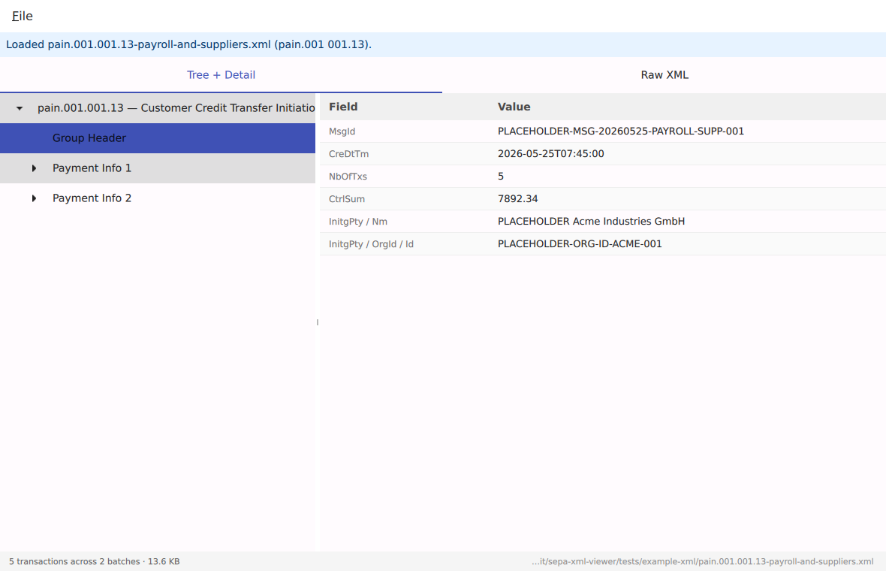
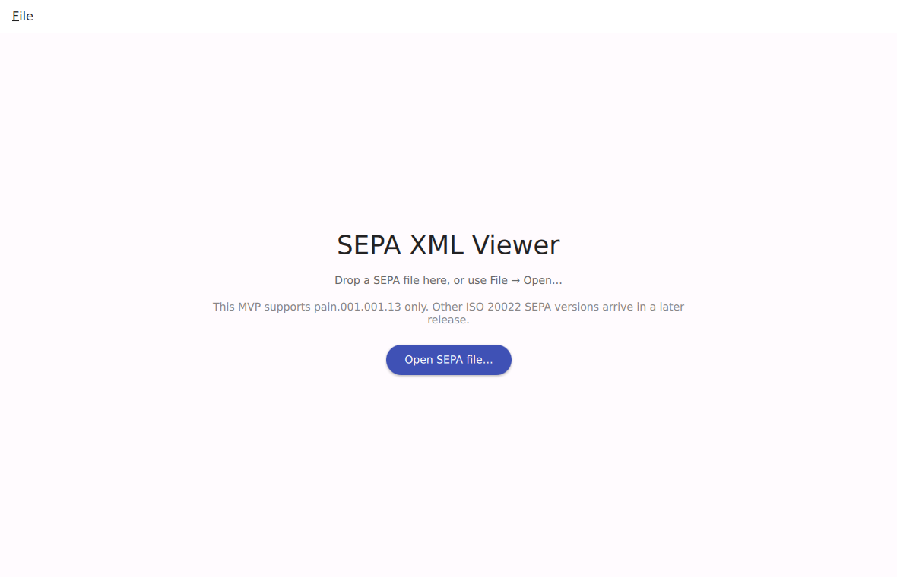

# SEPA XML Viewer

> [!WARNING]
> **Early alpha — not ready for production use.**
>
> This software is in active early-alpha development. It is **read-only** (it does not modify, write, or sign payment data) and runs **fully offline** (no network access, no telemetry, no cloud), so pointing it at sensitive files should be safe. That said, **no correctness or reliability guarantees are made**: the parser may misinterpret edge cases, validation may miss errors, and behavior may change between releases without notice.
>
> The GPL-3.0-or-later license already disclaims warranty in formal terms (the "AS IS" clause); this notice repeats that in plain language. If you depend on a payment file's contents being interpreted correctly for a real-money decision (releasing payroll, audit findings, regulatory submission), cross-check against another tool until this project reaches a stable 1.0 release.

A cross-platform desktop **viewer** for SEPA payment XML messages — the ISO 20022 files European banks, PSPs, and businesses exchange (`pain.001`, `pain.008`, `camt.05x`, the SRTP `pain.013` / `pain.014` family, and friends).



The above is the viewer with a sample `pain.001.001.13` file loaded: tree of group header → payment-info batches → transactions on the left, fields of the selected node on the right, with a Raw XML tab one click away. (Screenshot regenerated by `docs/screenshots/capture.sh`.)

## Who this is for

HR professionals, payroll administrators, accountants, and other office users who occasionally need to open a SEPA file their bank or payroll system produced and understand what is in it — without learning ISO 20022 jargon or installing a developer toolchain. The viewer ships as a native installer on Linux, macOS, and Windows and runs out of the box.

## What it does, and what it does not do

- It is **read-only**. It does not initiate, sign, edit, or alter payments.
- It runs **fully offline**. It does not make network requests, send telemetry, fetch updates, or download schemas at runtime. Enforced at build time — Qt is configured without its networking module and no networking dependency is permitted in the dependency manifest.

What it does *today* depends on which phase has shipped:

| Version | Status | What works |
| ------- | ------ | ---------- |
| `v0.0.1` | infrastructure proof | A window opens with a placeholder label. Build, CI, packaging, and the release pipeline are all wired up. SEPA files are not yet parsed. |
| `v0.1.0` (current, Phase 1 MVP) | shipped | Drag a `pain.001.001.13` file in → see the structure in a tree + detail view + raw XML tab. Single version, no plain-language relabeling, no XSD validation. Plan: [`plan/01-mvp-viewer.md`](plan/01-mvp-viewer.md). |
| Later | planned | Multi-version SEPA support, plain-language summary view, validation, exports, localization, signature verification. See [`plan/00-init-phase.md`](plan/00-init-phase.md) §13. |

<details>
<summary>Drop-here screen on first launch (click to expand)</summary>



</details>

## Install

Native installers for every platform live on the [Releases page](https://github.com/Yornik/sepa-xml-viewer/releases). Pick the right artefact for your OS, then follow the platform-specific notes — none of the current installers are code-signed, so each OS shows a security warning the first time you launch the binary.

### Linux

- `sepa-xml-viewer-<version>-Linux-x86_64.deb` — Debian / Ubuntu. Install with `sudo dpkg -i sepa-xml-viewer-*.deb`. Launch from your application menu or run `sepa-xml-viewer` from a terminal.
- `sepa-xml-viewer-<version>-Linux-x86_64.rpm` — Fedora / RHEL / openSUSE. Install with `sudo rpm -i sepa-xml-viewer-*.rpm` (or `sudo dnf install ./sepa-xml-viewer-*.rpm`).
- `sepa-xml-viewer-<version>-Linux-x86_64.AppImage` — distribution-independent portable binary. `chmod +x sepa-xml-viewer-*.AppImage` then double-click or run it. Nothing is installed system-wide; delete the file to uninstall.

No code signing is performed on Linux. If your distribution warns about an untrusted package, that warning is correct: you are installing a binary I built and signed with my key, which your system doesn't trust by default. The source is in this repository; you can also build from source ([§ Build from source](#build-from-source) below) if you'd prefer.

### macOS

- `sepa-xml-viewer-<version>-Darwin-arm64.dmg` — Apple Silicon Macs (M1/M2/M3/M4).

Double-click the `.dmg`, then drag `sepa-xml-viewer.app` into `/Applications`. The first launch will show **"sepa-xml-viewer can't be opened because Apple cannot check it for malicious software"** — this is Apple's Gatekeeper telling you the app isn't notarized. To bypass:

- **Right-click** (or Control-click) the app in `/Applications` → **Open** → click **Open** in the dialog. macOS remembers this choice and won't ask again.
- Or run once from a terminal: `xattr -dr com.apple.quarantine /Applications/sepa-xml-viewer.app`

Apple notarization costs $99/year and is on the Phase 5 roadmap (see [`plan/00-init-phase.md`](plan/00-init-phase.md) §13). Until then, the Gatekeeper warning is expected.

### Windows

- `sepa-xml-viewer-<version>-Windows-AMD64.exe` — NSIS installer. Installs to `C:\Program Files\SEPA XML Viewer\` and adds a Start menu shortcut.
- `sepa-xml-viewer-<version>-Windows-AMD64.zip` — portable ZIP. Extract anywhere; run `bin\sepa-xml-viewer.exe`.

Both are unsigned, so Windows SmartScreen will show **"Windows protected your PC — Microsoft Defender SmartScreen prevented an unrecognized app from starting"** on first launch. To bypass: click **More info** → **Run anyway**. Code signing (EV certificate, ~$250–$500/year) is on the Phase 5 roadmap.

If you prefer not to run unsigned binaries, build from source instead.

## Status

Phase 0 (development infrastructure) is complete: the build, CI, packaging, and release pipeline all work end-to-end. `v0.0.1` was the validation tag. Phase 1 (the MVP viewer that actually opens SEPA files) is in progress — see [`plan/01-mvp-viewer.md`](plan/01-mvp-viewer.md).

## Platforms

Linux, macOS (Apple Silicon), Windows — all from one C++20 / Qt 6 codebase.

## Tech stack

| Concern              | Choice                                          |
| -------------------- | ----------------------------------------------- |
| Language             | C++20                                           |
| Build system         | CMake 3.25+ with `CMakePresets.json`            |
| Dependency manager   | vcpkg (manifest mode)                           |
| GUI framework        | Qt 6 (Qt Quick / QML), dynamically linked, network feature disabled |
| XML library          | pugixml (parser); Xerces-C++ for XSD validation in Phase 2 |
| Test frameworks      | Catch2 v3 (unit + integration), Qt Test (GUI smoke) |
| Lint / format        | clang-format, clang-tidy, warnings-as-errors    |
| CI / packaging       | GitHub Actions matrix; CPack + AppImage + NSIS  |

Reasoning for each choice is in [`plan/00-init-phase.md`](plan/00-init-phase.md) §3.

## Build from source

Requirements: a C++20 compiler (GCC 12+, Clang 15+, MSVC 2022+), CMake 3.25+, Ninja, and either a vcpkg checkout (set `VCPKG_ROOT`) or a system Qt 6.5+ install. The vcpkg path is what CI uses and is the documented happy path.

```sh
# One-time: clone vcpkg and export the path
git clone https://github.com/microsoft/vcpkg ~/vcpkg
export VCPKG_ROOT=~/vcpkg

# Build + run tests
cmake --preset dev-debug
cmake --build --preset dev-debug
ctest --preset dev-debug --output-on-failure
```

The first configure is slow because vcpkg builds Qt and dependencies from source (warm-cache subsequent builds take minutes). On Linux you'll need Qt's build prerequisites — see the `Install Qt build prerequisites (Linux)` step in [`.github/workflows/ci.yml`](.github/workflows/ci.yml) for the canonical apt-get list. macOS needs Xcode command-line tools plus autotools (`brew install autoconf autoconf-archive automake libtool`). Windows needs Visual Studio Build Tools 2022.

CI uses `ci-linux`, `ci-macos`, `ci-windows` presets instead of `dev-debug` — same toolchain, Release configuration, warnings-as-errors. Full preset list in [`CMakePresets.json`](CMakePresets.json).

## SEPA standards reference

The viewer is built against published standards rather than guesses:

- **ISO 20022** — message catalogue at https://www.iso20022.org (administered by SWIFT). Canonical XSDs and current message versions live there (e.g. `pain.001.001.13`, `pain.008.001.12`).
- **European Payments Council (EPC)** — implementation guidelines at https://www.europeanpaymentscouncil.eu, including the SRTP V4.0 trio (EPC258-22 Payee, EPC259-22 Inter-RTP, EPC260-22 Payer). All canonical URLs are listed in [`plan/00-init-phase.md`](plan/00-init-phase.md) §2.3.1.

## Example data

A placeholder-marked but schema-shaped SEPA Credit Transfer file (`pain.001.001.13`) lives in [`tests/example-xml/`](tests/example-xml/). See [`tests/example-xml/README.md`](tests/example-xml/README.md) for the placeholder convention. **No real bank data is committed to this repository.**

## License

[GPL-3.0-or-later](LICENSE).

## See also

- [`plan/00-init-phase.md`](plan/00-init-phase.md) — design, decisions, and definition of done.
- [`CLAUDE.md`](CLAUDE.md) — onboarding for contributors and AI agents.
- [`CHANGELOG.md`](CHANGELOG.md) — release notes.
